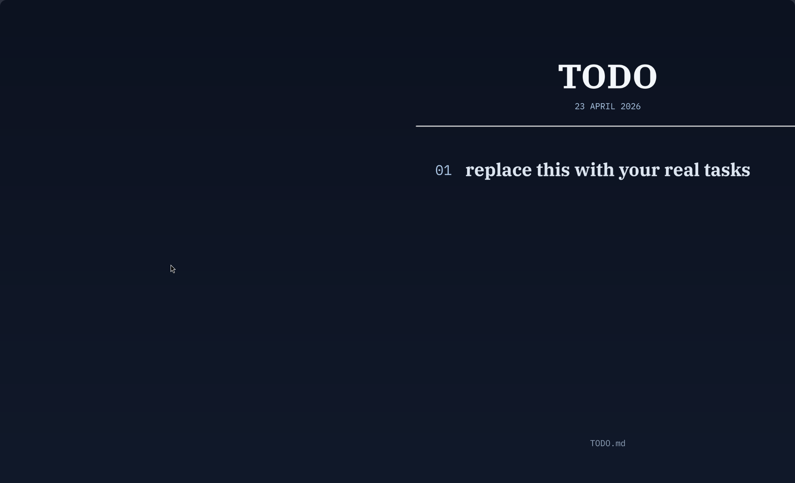

# todo_wallpaper

Turn a markdown TODO list into a desktop wallpaper.

`todo_wallpaper` supports two modes:
- a self-contained local install with a `todo-wallpaper` command and optional watcher
- a model-agnostic agent-skill install with runtime scripts, config, and skill instructions

At a glance:
- markdown priorities with `[H]`, `[M]`, and `[ ]`
- checked tasks stay visible and render scratched out
- left, center, or right layout placement
- display-only priority ordering without rewriting the source markdown
- explicit editing commands for add, replace, reprioritize, done, undone, and remove
- uninstall cleanup for runtime, config, launcher, units, and generated wallpapers

Suggested repo description:
- Turn a markdown TODO list into a desktop wallpaper, with a self-contained local CLI mode and a model-agnostic agent-skill mode.

## Screenshot



## Modes

- `self-contained`: installs runtime scripts under `~/.local/share/todo_wallpaper` plus optional `systemd --user` watcher units
- `agent-skill`: installs runtime scripts, config, and a model-agnostic skill file without installing a CLI wrapper, watcher, or model-specific tool

## Quick Start

Clone the repo, then choose one mode.

Self-contained install:

```bash
./install.sh
```

Agent-skill install:

```bash
./install.sh --agent-skill
```

After a self-contained installation, use the installed command:

```bash
todo-wallpaper list
todo-wallpaper refresh
todo-wallpaper show
todo-wallpaper hide
todo-wallpaper status
todo-wallpaper config
todo-wallpaper doctor
todo-wallpaper watch-on
todo-wallpaper watch-off
todo-wallpaper uninstall
```

Editing tasks:

```bash
todo-wallpaper list
todo-wallpaper edit
todo-wallpaper add "normal task"
todo-wallpaper add -n 2 -H "urgent inserted task"
todo-wallpaper replace -n 2 -M "important replacement"
todo-wallpaper change-priority -n 2 high
todo-wallpaper change-priority -n 2 -H
todo-wallpaper done -n 2
todo-wallpaper undone -n 2
todo-wallpaper done -n 2 -n 4
todo-wallpaper remove -n 2 -n 4
```

Task editing semantics:

- `add` appends by default, or inserts at `-n LINE` and pushes the following tasks down
- `replace` updates a task in place at `-n LINE`
- `change-priority` retags a task in place at `-n LINE` without changing its text
- `done` marks a task as checked so it stays visible and renders scratched out
- `undone` reopens a checked task
- `remove` deletes one or more tasks and reorders the remaining visible numbering
- `list` shows the current 1-based task numbering used by the edit commands
- `edit` opens the real TODO markdown in `$EDITOR`
- line-targeting commands use `-n` / `--line-number` only, to avoid positional ambiguity
- write operations create a `TODO.md.bak` backup beside the live todo file before saving

Priority syntax:

```md
- [H] urgent task
- [M] important task
- [ ] normal task
```

Display ordering:

- `DISPLAY_ORDER_PRIORITIES=true` by default
- when enabled, the wallpaper and `todo-wallpaper list` show tasks grouped as high, then medium, then normal
- order is stable within each priority group
- the markdown file is not rewritten just to reorder display
- numbered edit commands follow the same display order, so `done`, `replace`, `change-priority`, and `remove` target the visible numbering

For agent-skill mode:

```bash
./install.sh --agent-skill
```

Then start your agent in the installed runtime directory, or point it at the installed instructions:

```bash
cd ~/.local/share/todo_wallpaper
```

```text
~/.local/share/todo_wallpaper/AGENTS.md
```

The full skill reference is installed at:

```text
~/.local/share/todo_wallpaper/agent/SKILL.md
```

The agent should read `~/.config/todo_wallpaper/config.env`, detect `MODE`, and use only the interface allowed by that mode.

In `MODE=agent-skill`, the CLI is intentionally not installed. The agent edits the configured `TODO_FILE` or uses `edit_todo.py`, then refreshes with:

```bash
~/.local/share/todo_wallpaper/scripts/run_wallpaper_job.sh ~/.config/todo_wallpaper/config.env
```

By default, agent-skill mode stores the real TODO markdown at `~/TODO.md` so it stays outside the runtime directory.

In `MODE=self-contained`, an agent may use the `todo-wallpaper` CLI only after verifying it exists. If the CLI is missing, the self-contained install is incomplete and should be repaired instead of falling back silently.

Agentic best practices:

- start by reading `~/.config/todo_wallpaper/config.env`
- select the allowed interface from `MODE`
- use `todo-wallpaper` only in `MODE=self-contained` and only if the command exists
- never use `todo-wallpaper` in `MODE=agent-skill`
- edit only the configured `TODO_FILE` unless changing the tool itself
- use installed CLI/scripts instead of recreating renderer/backend logic
- refresh explicitly once after task edits through the allowed interface
- avoid watchers, systemd units, cron jobs, or provider-specific assumptions unless requested

## Demo File

The repo includes `TODO-demo.md` as a sample input file.
The real installed TODO file lives outside the repo unless you explicitly override it during install.

## Compatibility

Tested setup:

- Linux
- Wayland
- `niri`
- `noctalia-shell` / QuickShell IPC wallpaper flow
- self-contained mode
- agent-skill mode

Implemented backends that should work, but were not all validated equally in this repo:

- `noctalia` via `qs`
- `swaybg` for Sway-style Wayland sessions
- `hyprpaper` for Hyprland
- `gsettings` for GNOME
- `plasma-apply-wallpaperimage` for KDE Plasma
- `feh` for X11-style sessions

Practical disclaimer:

- the rendering and task-management logic is portable
- wallpaper application is desktop-session-specific
- if your compositor or desktop is different, rendering should still work, but auto-apply may need backend adjustments
- `todo-wallpaper doctor` is the first thing to run if install succeeds but wallpaper application does not

## Notes

- This repo is source/demo; the installed runtime lives under `~/.local/share/todo_wallpaper`.
- The actual TODO file should live outside the repo.
- Generated wallpapers should live under `~/Pictures/Wallpapers/...`.
- The renderer supports priority markers through markdown checkboxes like `[H]`, `[M]`, and `[ ]`.
- `DISPLAY_ORDER_PRIORITIES=true` keeps the display grouped by priority without rewriting the markdown source order.
- Checked tasks such as `- [X] done item` stay on the wallpaper and render with strike-through styling.
- `status` shows a short preview of the visible ordered task list.
- `config` prints the active config path and the key values in use.
- `doctor` prints a small runtime/backend sanity report for debugging apply failures.
- The self-contained mode can optionally enable a `systemd --user` watcher for file-triggered refreshes.
- In agent-skill mode, the installer only provides runtime scripts, config, and model-agnostic agent instructions. The agent performs edits and refreshes explicitly.
